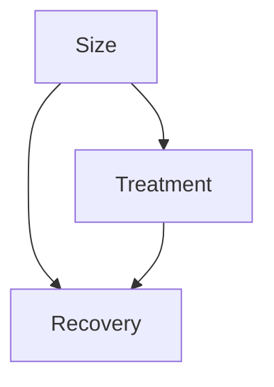

# Simpson's Paradox

Master in Data Science Upf - CI & ML - Part I

## Simpsons Paradox

| Treatment | Size  | Number | Recovered |
| :-------- | :---- | :----- | :-------- |
| A         | Small | 87     | 81        |
| B         | Small | 270    | 234       |
| A         | Large | 263    | 192       |
| B         | Large | 80     | 55        |

## Question

Which treatment is better?

A or B?

## Simpsons Paradox

|           | Treatment A    | Treatment B    |
| :-------- | :------------- | :------------- |
| Recovery  | 78% (273/350)  | **83% (289/350)** |

## Simpsons Paradox

|         | Treatment A      | Treatment B      |
| :------ | :--------------- | :--------------- |
| Small   | **93% (81/87)**  | 87% (234/270)    |
| Large   | **73% (192/263)** | 69% (55/80)      |

## A or B?

???
??

## Graph



## Exercise

How would look the graph of a RCT?

Draw the graph

## Covid Example

**(a) Case fatality rates (CFRs) by age group**

```
Bar chart comparing Case Fatality Rates (CFRs) for China (17 February) and Italy (9 March) across different age groups (0-9, 10-19, ..., 80+, Total).
For most age groups, Italy shows higher CFRs, especially in older groups (e.g., 70-79, 80+).
```

**(b) Proportion of confirmed cases by age group**

```
Bar chart comparing the Proportion of confirmed cases for China (17 February) and Italy (9 March) across different age groups.
Italy shows a higher proportion of confirmed cases in older age groups compared to China, while China has higher proportions in younger adult groups (e.g., 30-39, 40-49).
```

## Exercise

How different policies affect covid to different countries?

|       | Schools | Restaurants | Sporting events | Mass gatherings | Travel restrictions | Domestic lockdown |
| :---- | :------ | :---------- | :-------------- | :-------------- | :------------------ | :---------------- |
| UK    | X       | X           | X               | X               |                     |                   |
| Denmark |         |             |                 |                 |                     |                   |
| France | X       | X           | X               |                 | X                   | X                 |
| Germany | X       | X           |                 |                 |                     |                   |
| USA   | X       | X           | X               |                 | X                   | X                 |
| Israel | X       | X           | X               | X               | X                   | X                 |
| Spain | X       | X           | X               |                 | X                   | X                 |
| Italy | X       | X           | X               | X               | X                   | X                 |
| Ireland | X       | X           | X               |                 | X                   | X                 |
| Malta | X       | X           | X               | X               | X                   | X                 |
| Norway | X       | X           | X               |                 | X                   | X                 |

**Tweet from Adriana Castelli (@CastelliAdriana):**
"UK is clearly the control group" (1:01 a.m. 14 mar. 2020)
*Replies and comments from other users discussing the policies and the evolving situation.*

Which are possible confounders?

## References

*   **Causal Inference and AB testing - BcnAnalytics:**
    https://www.youtube.com/watch?v=rQKPrry6g0g
*   **Introduction to Causal Inference - XEurope:**
    https://www.youtube.com/watch?v=E3E13PDn7K8&t=89s
*   **"Causal Inference for Data Science" A.Ruiz de Villa, Manning 2024 (Chapter 2)**
    *   Code: https://github.com/aleixrvr/CausalInference4DataScience
    *   Quick questions: https://livebook.manning.com/book/causal-inference-for-data-science/
*   **"Causal Inference in Statistics: a Primer" J.Pearl, M.Glymour, N.P. Jewell. Wiley 2016**

## Conclusions

## Conclusions

*   The fact that there is positive correlation between two variables, doesn't mean that causation is also positive.
*   Including new variables in the analysis can totally change the direction of the conclusions.