```json
{
  "summary": "This lecture explains Simpson's Paradox, derives the adjustment formula in causal inference, and discusses when and how to apply it using intervention calculus and potential outcomes.",
  "topics": [
    "Simpson's Paradox",
    "Causal Inference",
    "Adjustment Formula",
    "Potential Outcomes",
    "Causal Graphs"
  ],
  "doc_type": "Lecture",
  "difficulty": 7,
  "study_time": 60
}
```
---

# Solving Simpson's Paradox

Master in Data Science Upf - CI & ML - Part I

## Objectives

*   Solve Simpson's Paradox
*   Derive the adjustment formula
*   Understand when do we need the adjustment formula

# Simpson's Paradox

## Simpsons Paradox

| Treatment | Size   | Number | Recovered |
| :-------- | :----- | :----- | :-------- |
| A         | Small  | 87     | 81        |
| B         | Small  | 270    | 234       |
| A         | Large  | 263    | 192       |
| B         | Large  | 80     | 50        |

## Simpsons Paradox

| Size     | Treatment A     | Treatment B     |
| :------- | :-------------- | :-------------- |
| Recovery | 78% (273/350)   | 81% (284/350)   |

## Simpsons Paradox

|        | Treatment A   | Treatment B   |
| :----- | :------------ | :------------ |
| Small  | 93% (81/87)   | 87% (234/270) |
| Large  | 73% (192/263) | 62% (50/80)   |

## Graph

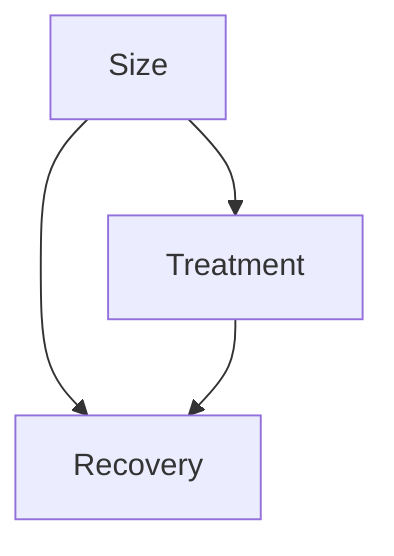

## Size Distribution

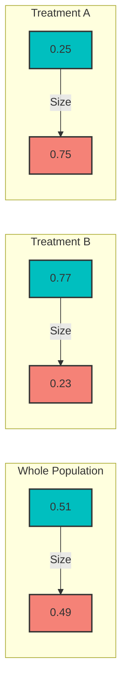
*Note: The chart shows proportions, not actual graph connections.*
- Whole Population: Small 51%, Large 49%
- Treatment B: Small 77%, Large 23%
- Treatment A: Small 25%, Large 75%

## Extreme Assignments

|        | Treatment A | Treatment B |
| :----- | :---------- | :---------- |
| Small  | 93% (0)     | 87% (350)   |
| Large  | 73% (350)   | 62% (0)     |
| Both   | 73%         | 87%         |

## Extreme Assignments

|        | Treatment A | Treatment B |
| :----- | :---------- | :---------- |
| Small  | 93% (350)   | 87% (0)     |
| Large  | 73% (0)     | 62% (350)   |
| Both   | 93%         | 63%         |

## Main Problem

If the hospital can choose only one treatment which one should be?

Ideally...

1.  Give everyone treatment A -> measure efficiency
2.  Give everyone treatment B -> measure efficiency
3.  Compare and choose the best one

## Exercise

## Intuitive Solution

*   How would look the graph where everyone is treated with treatment A?
*   Which proportion of Large/Small size would have treatment A?
*   How would look the graph of a RCT?
*   Which proportion of Large/Small size would have treatment A when doing a RCT?

## RCT and constant treatment graphs

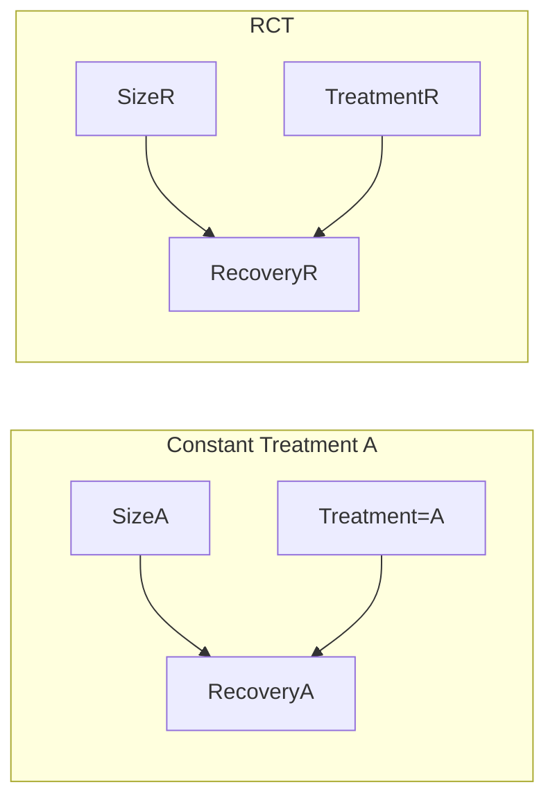

## Intuitive Solution

### Conditional Probability

$P(R=1| T=A) = P(R=1| T=A, S=Small) * P(S=Small|T=A) + P(R=1| T=A, S=Large) * P(S=Large|T=A)$
$= 93\% * 25\% + 73\% * 75\% = 78\%$

### Proposed Solution

$P(R=1| T=A, S=Small) * P(S=Small) + P(R=1| T=A, S=Large) * P(S=Large)$
$= 93\% * 51\% + 73\% * 49\% = 83\%$

## Conditioning: a reminder

In data, conditioning Y| X=x means selecting the cases X=x

| X | Y      |
| :- | :----- |
| 5 | 0.0056 |
| 7 | -2.001 |
| X | 1.8    |
| ... | ...    |
| 8 | 0.003  |
| X | 0.9    |
| ... | ...    |

$\rightarrow$

| X | Y   |
| :- | :-- |
| X | 1.8 |
| X | 0.9 |
| ... | ... |

## Exercise

## Intuitive Solution

*   Make same calculations with B. Which is better?

## Intuitive Solution

### Conditional Probability

$P(R=1| T=B) = P(R=1| T=B, S=Small) * P(S=Small|T=B) + P(R=1| T=B, S=Large) * P(S=Large|T=B)$
$= 87\% * 77\% + 62\% * 23\% = 81\%$

### Proposed Solution

$P(R=1| T=B, S=Small) * P(S=Small) + P(R=1| T=B, S=Large) * P(S=Large)$
$= 87\% * 51\% + 62\% * 49\% = 75\%$

## Adjustment Formula

1.  We need to give a name to this new quantity
2.  Typical confounders in everyday analysis: gender, age, location, time of the year, ...
3.  Almost by default, (bio/healthcare) statisticians, economists and related, adjust by these variables

# The Language of Interventions

## What is an intervention?


## Intervention formal definition

An intervention of a variable T with a value x, is an operation on the graph:

1.  Remove all arrows incoming to T
2.  Set the value of T constant to x

Graph intervention $\Rightarrow$ Mathematical modelization of an intervention in reality

## What is an intervention?

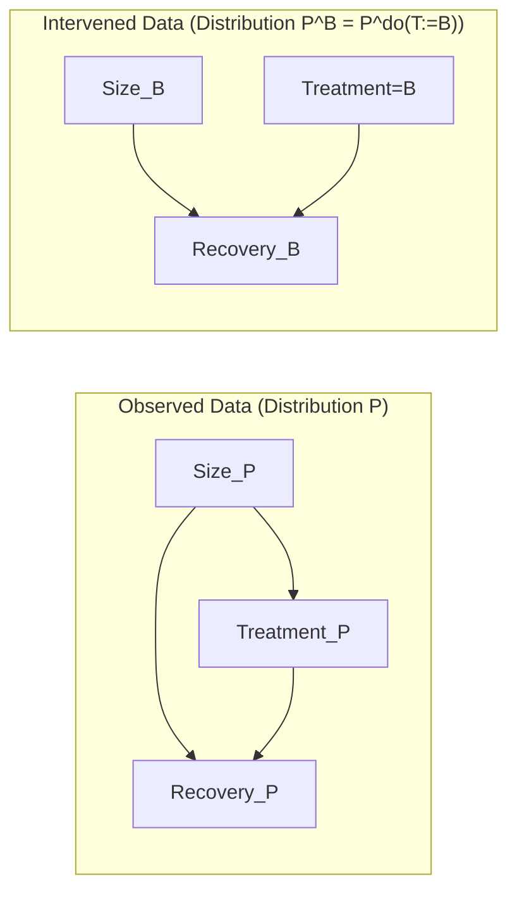

## Main objective of causal inference

```mermaid
graph LR
    subgraph "Observational data"
        Size_obs --> Treatment_obs
        Size_obs --> Recovery_obs
        Treatment_obs --> Recovery_obs
    end
    step[Use observational data <br/> To infer about interventional data] -- arrow -->
    subgraph "Interventional data"
        Size_int --> Recovery_int
        Treatment_int[Treatment=A] --> Recovery_int
    end
```

## Causal Formalism

```mermaid
graph LR
    subgraph "Observed Data (Distribution P)"
        S_obs[S := ε_s]
        T_obs[T := f_T(S, ε_T)]
        R_obs[R := f_R(T, S, ε_R)]
    end
    subgraph "Intervened Data (Distribution P^A = P^do(T:=A))"
        S_int[S := ε_s]
        T_int[T := A]
        R_int[R := f_R(T, S, ε_R)]
    end
```

## The meaning of :=

*   Causality is directional
*   Not mathematical equality, but as 'programming assignment'

## Calculation of P^A

### Conditional Probability

$P^A(R=1) = P^A(R=1, S=Small) + P^A(R=1, S=Large)$
$= P^A(R=1| S=Small) * P^A(S=Small) + P^A(R=1| S=Large) * P^A(S=Large)$
$= P^A(R=1| S=Small, T=A) * P^A(S=Small) + P^A(R=1| S=Large, T=A) * P^A(S=Large)$
$= P(R=1| S=Small, T=A) * P(S=Small) + P(R=1| S=Large, T=A) * P(S=Large)$

We have used the assumptions (by construction)
*   $P^A(R=1| S=Small, T=A) = P(R=1| S=Small, T=A)$
*   $P^A(S=Small) = P(S=Small)$

## Adjustment formula

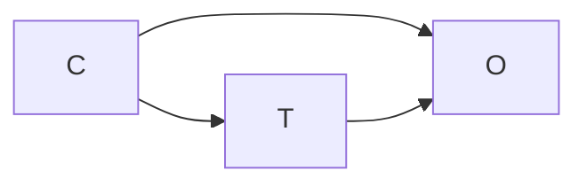

For any variables T, C, O
$P^{T=t}(O=1) = \sum_c P(O = 1| C = c, T = t) P(C = c)$

Note: this is different from
$P(O=1|T=t) = \sum_c P(O = 1| C = c, T = t) P(C = c|T=t)$

## Average Treatment Effect (ATE)


For any variables T, C, O
$ATE = P^{T=1}(O=1) - P^{T=0}(O=1)$

What does it mean to have ATE > 0?

# When to adjust?

## Exercise

## Do we need to adjust?

1.  Draw the intervened graph
2.  Take conclusions


## Exercise

## Do we need to adjust?

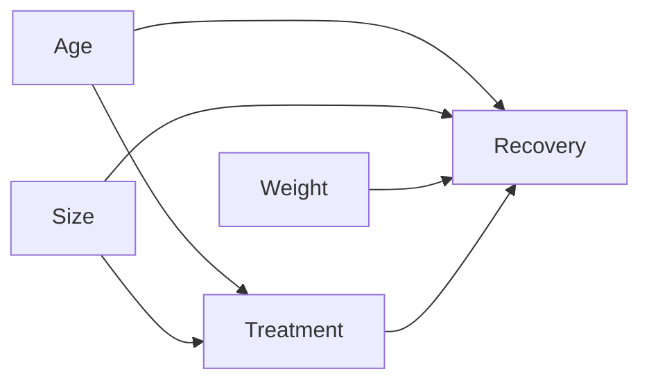

## Exercise

## Do we need to adjust? What can we do?

Here Size is an unobserved variable: you know it affects, but you don't have this information

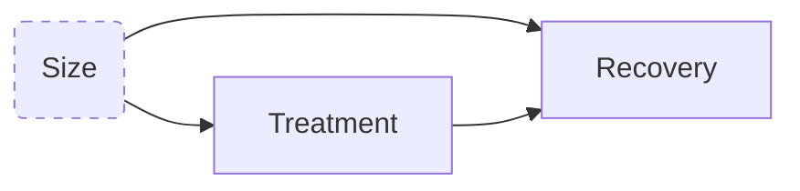

## Summary

| Graph type                        | DAG                                    | Observed probability P(O|T=A) | Intervened probability P(O|do(T=A)) | Adjusted formula |
| :-------------------------------- | :------------------------------------- | :---------------------------- | :---------------------------------- | :--------------- |
| Randomized controlled trial (X covariates) | `X --> T`, `X --> O`, `T --> O`        | =                             | =                                   | =                |
| Confounder (C)                    | `C --> T`, `C --> O`, `T --> O`        | !=                            | =                                   | =                |
| Mediator (M)                      | `T --> M`, `M --> O`, `T --> O`        | =                             | =                                   | !=               |
| Collider (C)                      | `T --> C <-- O`                        | =                             | =                                   | !=               |

This table shows when the following quantities match up and when they don't when studying the effect of a treatment or decision variable (T) on an outcome (O):

*   The observed historical data, denoted mathematically as P(O|T=A)
*   The hypothetical situation in which we alter (intervene in) the system, denoted mathematically as P(O|do(T=A))
*   An estimator, known as the adjustment formula, which sometimes agrees with the intervened quantity P(O|do(T=A)) and sometimes doesn't, depending on the structure of the graph (DAG).

# Heterogeneous Treatment Effects

## Heterogeneous treatment effects


What should we do if we want to estimate the causal effect at some particular level C=c?

## Heterogeneous treatment effects

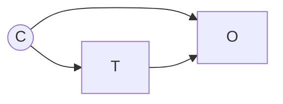

What should we do if we want to estimate the causal effect at some particular level C=c?

$ATE(C=c) = P(O=1|T=1, C=c) - P(O=1|T=0, C=c)$

NOTE: the function P(O|T=t, C) can be estimated using logistic regression, or, in fact, a machine learning model that predicts O from T and C

## Heterogeneous treatment effects

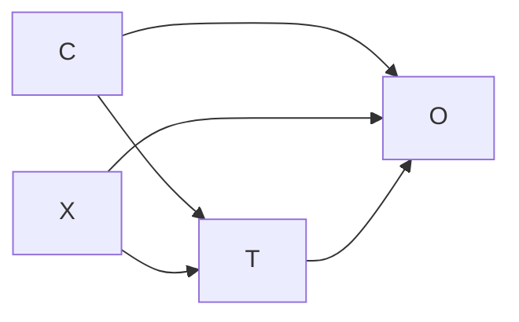

What should we do if we want to estimate the causal effect at some particular level C=c?

## Heterogeneous treatment effects

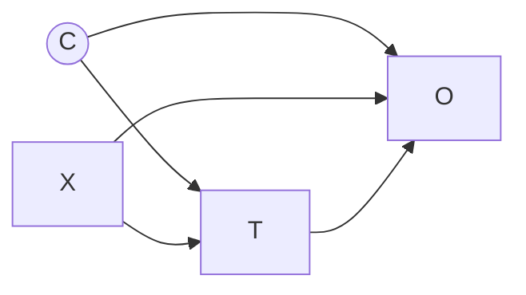

What should we do if we want to estimate the causal effect at some particular level C=c?
We should apply the adjustment formula at level C=c

$ATE(C=c) = P(O=1|do(T=1), C=c) - P(O=1|do(T=0), C=c)$
$P(O=1|do(T=t), C=c) = \sum_X P(O = 1| T = t, X=x, C = c) P(X=x| C = c)$

## Heterogeneous treatment effects

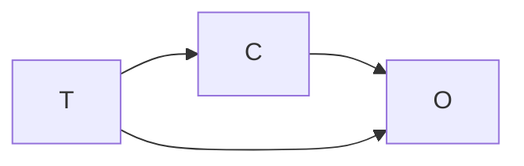

What should we do if we want to estimate the causal effect at some particular level C=c?

## We would need to use counterfactuals!


There is an intrinsic conflict, because if you select those patients with C=c, and hypothetically intervene on T, the intervention itself could change again the value of C!

# Connection to Potential Outcomes

## Definition

We have variables:
*   T treatment (with values 0 or 1) or decision variable
*   u units (or individuals)
*   Y outcome

Observed: $Y(u)$ is the outcome of unit u

Potential Outcomes:
$Y_t(u)$ ($Y_0(u)$ and $Y_1(u)$) is the outcome Y of unit u, if we only set the value T, but we don't direct affect any other variable of the system.

## Bridge between frameworks

```mermaid
graph LR
    subgraph Potential Outcome Y1
        V1 --> Y1
        T1[T=1] --> Y1
    end
    text1[Y₁ = Y|do(T=1)]

    subgraph Potential Outcome Y0
        V0 --> Y0
        T0[T=0] --> Y0
    end
    text0[Y₀ = Y|do(T=0)]
```

## Adjustment Formula

Under strong ignorability
$Y_0, Y_1 \perp T | C$

Then
$ATE = E[Y_1 - Y_0] = E[E[Y|C, T=1]] - E[E[Y|C, T=0]]$

## Adjustment Formula Estimation

You can apply the adjustment formula with matching methods learned in previous courses.

However, we will see it is more efficient to estimate them using machine learning models

# Conclusions

## Conclusions

*   Data does not speak by itself
*   More data does not solve the problem
*   Which variables do we need to take into account in our analysis?
*   Correlation is not enough $\rightarrow$ you need directionality
*   Different models lead to different conclusions: Domain knowledge is crucial
*   Graphs are a great communication tool
*   Risks: What about confounders that you missed?

## References

"Causal Inference for Data Science" A.Ruiz de Villa, Manning 2024 (Chapter 2)
Quick questions: https://livebook.manning.com/book/causal-inference-for-data-science/

"Causal Inference in Statistics: a Primer" J.Pearl, M.Glymour, N.P. Jewell. Wiley 2016

"Elements of Causal Inference" Jonas Peters, Dominik Janzing and Bernhard Schölkopf
(https://mitp-content-server.mit.edu/books/content/sectbyfn?collid=books_pres_0&id=11283&fn=11283.pdf)